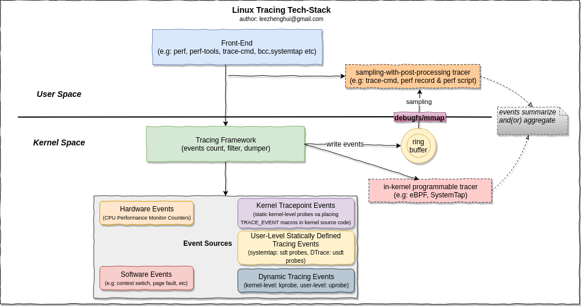
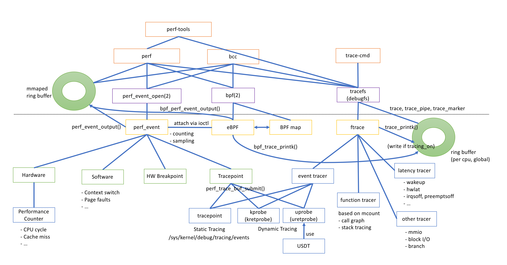
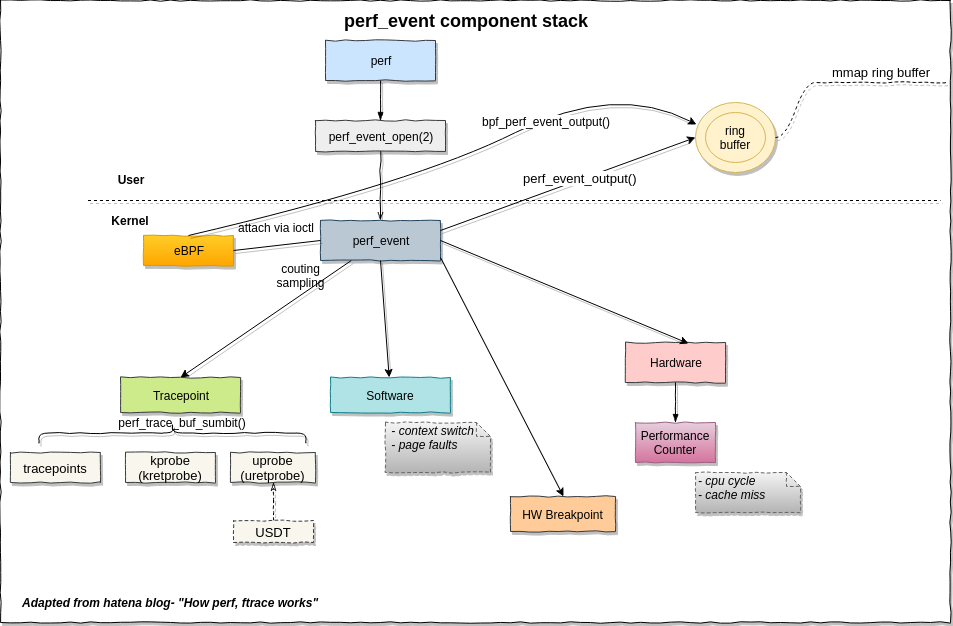
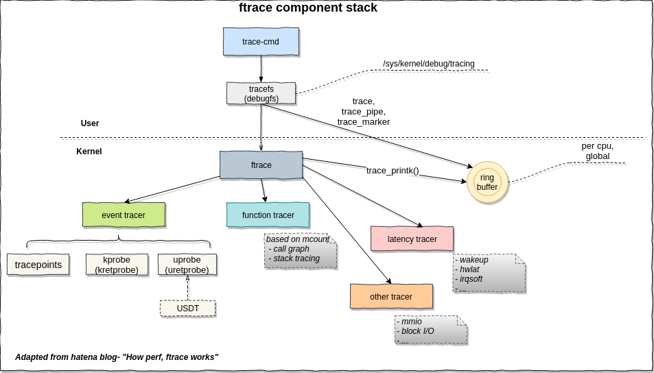
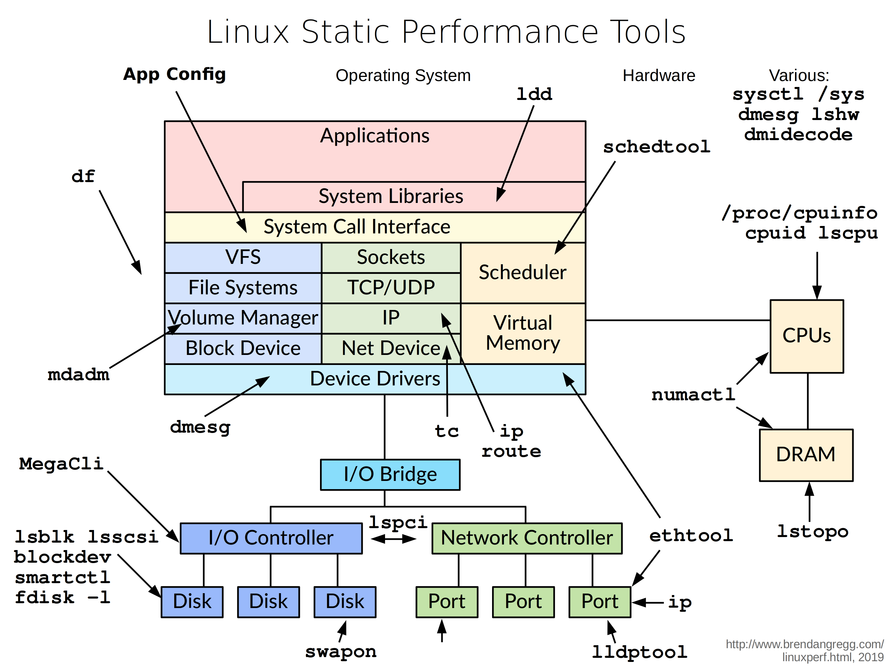

# Linux性能优化及跟踪 #

## 一. 总览
### 1.1. 概述

### 1.2 跟踪技术发展

### 1.3 跟踪机制与框架Tracing Framework 
#### perf_event、eBPF、ftrace三者关系
 from [mmi.hatenablog.com](http://mmi.hatenablog.com)

#### perf_event

#### eBPF

#### ftrace

### 1.3 事件源Event Sources
 from [www.brendangregg.com](http://www.brendangregg.com)

### 1.4 工具Front-End

> 
> 
 观察工具|分析工具|测试工具|调整工具
 ---|---|---|---
 |  |  | 

 from [www.brendangregg.com](http://www.brendangregg.com)

 #### perf-tools使用

 #### perf使用

 #### trace-cmd使用

## 二、
### 进程相关
- top命令
	
	

	1. 20:37:38是当前时间，up 2:20是系统运行多长时间，2 users指出当前用户登录数，load average指出系统负载，三个值分别是1分钟，5分钟，15分钟的系统负载平均值；（等同于uptime）
	2. Task指出了当前系统有多少个进程，以及各种状态的进程统计信息
	3. %Cpu(s)，代表了CPU占用比例
	
		>us用户模式 sy系统模式 ni优先值 id空闲CPU百分比 wa等待输入输出CPU百分比 hi中断 si软中断 st？
	4. 物理内存信息
	5. 交换内存信息
	6. 
		- PID 进程的PID
		- USER 用户名，任务属主
		- PR 任务的优先级
		- NI 优先值
		- VIRT 虚拟映像（kb），任务当前使用的虚拟内存数量
		- RES 常驻物理内存占用量，RES=CODE+DATA
		- SHR 共享内存大小（kb）
		- S 进程状态（D-不可中断的睡眠，R-运行，S-睡眠，T-停止，Z-僵尸进程）
		- %CPU CPU使用量
		- %MEM 内存使用量
		- TIME+ CPU时间，百分之一
		- COMMAND 程序名称

- ps命令

- pgrep命令，根据名称或者其它属性查询进程信息
	
	

- pstack命令，显示进程的栈跟踪信息
	
	

- strace命令，跟踪系统调用
	
	

	    -p pid,直接attach上去跟踪
	    -e open,futex等，过滤指定系统调用
	    -c，统计系统调用

### 网络相关
- nc命令，用于创建任意的TCP/UDP连接或者是监听连接
	
	
			
		#传递文件
		server: nc -l 8888 > filename.out
		client: nc ip 8888 < filename.in

		#传递整个目录
		server： nc -l 8888 | tar zxvf -
		client： tar zcvf - dirname |nc server 8888
				
		#模拟http请求
		echo -n "GET / HTTP/1.0\r\n\r\n" | nc webserver 80

		#扫描端口
		nc -z server 1-100

- ss命令，显示socket的统计信息

	

## 三、资料
1. [Exploring USDT Probes on Linux](https://leezhenghui.github.io/linux/2019/03/05/exploring-usdt-on-linux.html)
1. [Linux 系统动态追踪技术介绍](https://blog.arstercz.com/introduction_to_linux_dynamic_tracing/)
1. [Brendan Gregg' Blog - perf Examples](http://www.brendangregg.com/perf.html#SoftwareEvents)
1. [Brendan Gregg' Blog - Linux uprobe: User-Level Dynamic Tracing](https://webrtc.org.cn/webrtc-tutorial-1-setup-signaling/)
1. [玩转 utrace](https://www.ibm.com/developerworks/cn/linux/l-cn-utrace/)
1. [Ftrace简介](http://www.ibm.com/developerworks/cn/linux/l-cn-ftrace/)
1. [使用ftrace调试Linux内核，一](http://www.ibm.com/developerworks/cn/linux/l-cn-ftrace1/)
1. [使用ftrace调试Linux内核，二](http://www.ibm.com/developerworks/cn/linux/l-cn-ftrace2/)
1. [使用ftrace调试Linux内核，三](http://www.ibm.com/developerworks/cn/linux/l-cn-ftrace3/)
1. [Ftrace 实现原理与开发实践](http://tinylab.org/ftrace-principle-and-practice/)
1. [ftrace 中 eventtracing 的实现原理](https://www.ibm.com/developerworks/cn/linux/1609_houp_ftrace/)
1. [使用 ftrace 跟踪内核](https://linux.cn/article-9838-1.html)