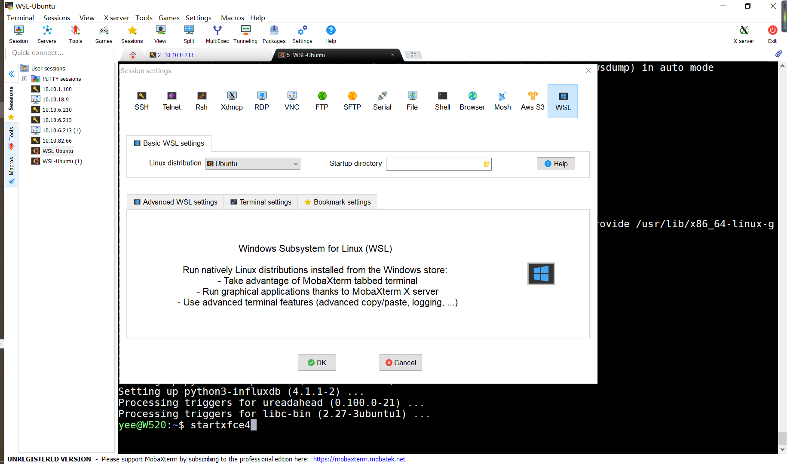

## 打开WSL并安装Ubuntu
	启动或关闭windows功能，勾选WSL
	Mircrosoft Store中找到Ubuntu并安装	

## WSL中安装xfce4桌面
	sudo apt-get install xfce4-terminal
	sudo apt-get install xfce4

## 配置
	export DISPLAY=:0.0
	export LIBGL_ALWAYS_INDIRECT=1

## 开启WSL中Xfce4

